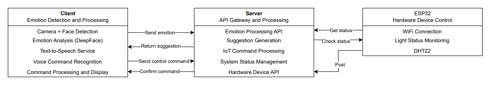

# 🎓 DaiNam University 

<div align="center">

<p align="center">
  
  
</p>

[](https://fit.dainam.edu.vn)
[](https://fit.dainam.edu.vn)
[](https://dainam.edu.vn)


# Hệ Thống Nhận Diện Cảm Xúc và Tương Tác Môi Trường
</div>
Hệ thống thông minh nhận diện cảm xúc của người dùng qua khuôn mặt và giọng nói, kết hợp với điều khiển các thiết bị IoT (đèn, nhạc, nhiệt độ) để tạo môi trường phù hợp với trạng thái cảm xúc.


## Tổng Quan

Hệ thống bao gồm ba thành phần chính:

1. **Ứng dụng Client**: Chạy trên máy tính, sử dụng camera để nhận diện cảm xúc qua khuôn mặt và micro để nhận diện lệnh giọng nói
2. **IoT Server**: Điều khiển và quản lý các thiết bị IoT (đèn, nhạc, cảm biến)
3. **Thiết Bị IoT**: ESP32 kết nối với đèn và các thiết bị thông minh khác
      
Kiến trúc:
<p align="center">
  
</p>


## Chức Năng Chính

- **Nhận diện cảm xúc**: Phát hiện 7 cảm xúc cơ bản (vui vẻ, buồn, tức giận, bình thường, ngạc nhiên, sợ hãi, kinh tởm)
- **Điều khiển bằng giọng nói**: Nhận diện và thực hiện lệnh điều khiển thiết bị
- **Tự động đưa ra đề xuất**: Dựa trên cảm xúc để điều chỉnh môi trường (bật/tắt đèn, phát nhạc phù hợp)
- **Phản hồi bằng giọng nói**: Thông báo và phản hồi bằng giọng nói tiếng Việt


## Cài Đặt và Chạy

### 1. Cài đặt các gói phụ thuộc

```bash
pip install -r requirements.txt
```

### 2. Khởi động Server IoT

```bash
cd server
python app.py
```

Server sẽ chạy ở địa chỉ: http://localhost:5000

### 3. Khởi động Client

```bash
cd client
python main.py
```

### 4. Nạp code cho ESP32 (tùy chọn)

Nếu có ESP32, hãy nạp code từ thư mục `done/done.ino` sử dụng Arduino IDE.

## Hướng Dẫn Sử Dụng

1. **Nhận diện cảm xúc**:
   - Đứng trước camera để hệ thống nhận diện khuôn mặt và phân tích cảm xúc
   - Hệ thống sẽ thông báo cảm xúc đã phát hiện và đưa ra các đề xuất


2. **Điều khiển bằng giọng nói**:
   - Nói các câu lệnh như: "bật đèn", "tắt đèn", "phát nhạc", "dừng nhạc", v.v.
   - Hoặc tương tác với đề xuất: "đọc đề xuất", "chọn đề xuất một"


3. **Xem trạng thái hệ thống**:
   - Truy cập vào giao diện web của server tại http://localhost:5000
   - Hoặc sử dụng lệnh giọng nói "trạng thái"
   

## Các Lệnh Giọng Nói

- **Điều khiển đèn**: "bật đèn", "tắt đèn", "mở đèn", "đóng đèn"
- **Điều khiển nhạc**: "bật nhạc", "tắt nhạc", "phát nhạc", "dừng nhạc"
- **Nhạc theo cảm xúc**: "nhạc vui", "nhạc buồn", "nhạc bình thường", "nhạc tức giận"
- **Điều chỉnh âm lượng**: "tăng âm lượng", "giảm âm lượng", "to hơn", "nhỏ hơn"
- **Thông tin khác**: "thời tiết", "nhiệt độ", "trạng thái"
- **Tương tác đề xuất**: "đọc đề xuất", "chọn đề xuất một", "chọn đề xuất hai"

## Cảm Xúc Được Hỗ Trợ

- Vui vẻ (Happy)
- Buồn (Sad)
- Tức giận (Angry)
- Ngạc nhiên (Surprise)
- Sợ hãi (Fear)
- Kinh tởm (Disgust)
- Bình thường (Neutral)

## Tùy Chỉnh

### Thay đổi cấu hình

Chỉnh sửa file `client/config.py` để thay đổi:
- Địa chỉ server IoT
- Cấu hình camera
- Âm thanh và nhãn cảm xúc


## Giải Quyết Sự Cố

1. **Không nhận diện được khuôn mặt**:
   - Đảm bảo khuôn mặt đủ sáng
   - Điều chỉnh CAMERA_WIDTH và CAMERA_HEIGHT trong config.py

2. **Không nhận diện được giọng nói**:
   - Kiểm tra kết nối microphone
   - Điều chỉnh tham số trong hàm listen() của VoiceService

3. **Không kết nối được với server**:
   - Kiểm tra địa chỉ IP trong config.py
   - Đảm bảo server đang chạy

## Phát Triển Thêm

Một số ý tưởng để phát triển mở rộng:

1. Thêm nhận diện cảm xúc qua giọng nói
2. Tích hợp với các nền tảng IoT phổ biến (HomeAssistant, Google Home, etc.)
3. Thêm giao diện web cho client
4. Cải thiện thuật toán nhận diện cảm xúc
5. Thêm hỗ trợ cho các cảm biến thực (thay vì dữ liệu giả lập)


